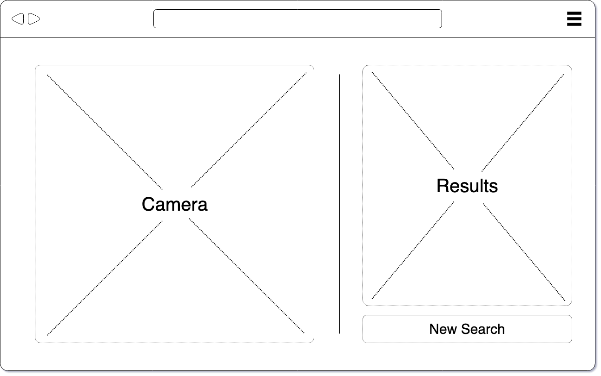
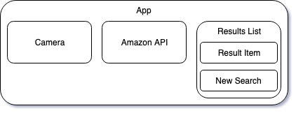

# Barcode (working title)

This single page web app makes use of a computers webcam to decode barcodes to get the products UPC. It then uses the barcode to do a product lookup (yet to be determined what this specifically looks like) and displays the results.

## Installation

1. Clone from `https://github.com/ben-kirby/barcode.git`
2. In parent directory, run `$ npm install; npm run start`
3. In your browser, navigate to `localhost:8080`

## Structure

### UI

### Component Tree

## Features

## Known Issues

## Whats Next